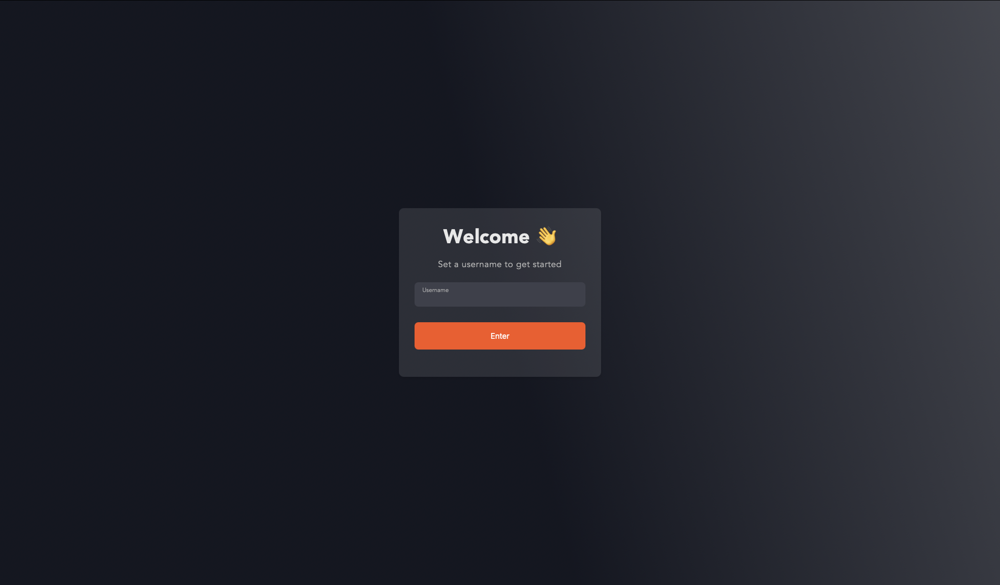

# VibeChat

VibeChat is a web application that enables users to communicate in real-time through instant messaging, media sharing, and group chats. This application is built with React.js on the frontend and Node.js on the backend.



## Key Features

- **User Login**: Users can log in with their username.
- **Real-Time Chat**: Users can send and receive messages instantly.
- **Integration with Chat Engine API**: Utilizes the Chat Engine API to manage users and messages.
- **Group Chats**: Users can create and join group chats.
- **Media Sharing**: Users can share images and videos in chats.

## Technologies Used

- **Frontend**: React.js, Vite, Axios, PropTypes, React Chat Engine Pretty
- **Backend**: Node.js, Express.js, Axios, CORS, Helmet, Express Rate Limit, Dotenv
- **Linting**: ESLint, eslint-plugin-react-hooks, eslint-plugin-react-refresh
- **Build Tool**: Vite

## Installation

### Backend

1. Clone this repository:
    ```sh
    git clone https://github.com/Halfirzzha/VibeChat.git
    cd VibeChat/backend
    ```

2. Install dependencies:
    ```sh
    npm install
    ```

3. Create a `.env` file and add the following environment variables:
    ```env
    PORT=3001
    PRIVATE_KEY=your_private_key_here
    ```

4. Start the backend server:
    ```sh
    npm start
    ```

### Frontend

1. Navigate to the frontend directory:
    ```sh
    cd ../frontend
    ```

2. Install dependencies:
    ```sh
    npm install
    ```

3. Start the frontend application:
    ```sh
    npm run dev
    ```

## Usage

Once both the backend and frontend are running, open your browser and access the application at `http://localhost:3001`.

## Project Structure

```
vibechat/
├── backend/
│   ├── .env
│   ├── index.js
│   ├── package.json
│   └── request.rest
├── frontend/
│   ├── public/
│   ├── src/
│   │   ├── App.css
│   │   ├── App.jsx
│   │   ├── AuthPage.jsx
│   │   ├── ChatsPage.jsx
│   │   ├── index.css
│   │   ├── main.jsx
│   └── package.json
├── .gitignore
└── README.md
```

- **backend/**: Contains the backend server code built with Node.js and Express.
- **frontend/**: Contains the frontend application code built with React.js.
- **.gitignore**: File to ignore specific files and directories in the git repository.
- **README.md**: This file, containing information about the project.

## Resources

- Blog: [Fullstack Chat with Node.js and React.js](https://blog.chatengine.io/fullstack-chat/nodejs-reactjs)
- Video: [Fullstack Chat Tutorial](https://youtu.be/Fzv-rgwcFKk?si=TZmDHO4UAemAkjEt)
- Sign up at Chat Engine: [Chat Engine](https://chatengine.io/)

## License

This project is licensed under the MIT License. See the [LICENSE](LICENSE) file for more information.

## Contact

For further inquiries, please contact us through the buttons below:

[](https://www.instagram.com/halfirzzha)
